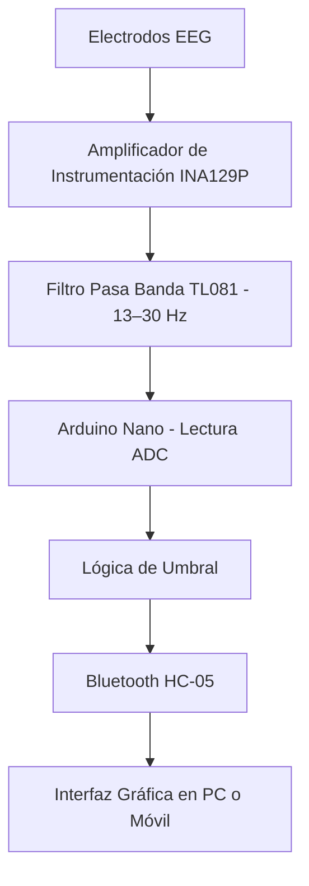

# 2025_EWHRA
# EWHRA - Electroencephalographic Wave Helmet to Regulating Attention

## 📋 Resumen del Proyecto
**EWHRA** es un sistema portátil diseñado para detectar **excesos de relajación mental** mediante el análisis de ondas cerebrales **beta (13–30 Hz)** usando tecnología EEG.  
Su objetivo es proporcionar **retroalimentación inmediata** cuando se detecta una caída en el nivel de atención, mostrando el estado del usuario a través de una **interfaz gráfica**.

---

## 🎯 Objetivos

### Objetivo General
Desarrollar un sistema portátil que, mediante señales EEG, detecte en tiempo real la disminución de atención y emita retroalimentación inmediata para mantener el foco o indicar que se debe detener la actividad.

### Objetivos Específicos
- Medir señales EEG con electrodos de oro según el sistema **10/20**.
- Amplificar y filtrar las señales EEG para centrarse en ondas **beta**.
- Implementar un **umbral configurable** para determinar el estado de atención.
- Proveer retroalimentación sensorial inmediata al detectar relajación excesiva.
- Transmitir el estado del usuario a una interfaz externa vía **Bluetooth**.

---

## ⚙️ Especificaciones del Sistema

### Requerimientos Funcionales
- Detección de ondas **beta** mediante tres electrodos de Au.
- Amplificación y filtrado en el rango 13–30 Hz.
- Aislamiento frente a interferencias electromagnéticas.
- Evaluación de señal contra umbral definido.
- Retroalimentación física o visual ante relajación excesiva.
- Transmisión de estado vía Bluetooth.
- Alimentación con batería de 9 V.

### Requerimientos No Funcionales
- Comodidad de uso.
- Análisis en tiempo real sin latencia perceptible.
- Instrucciones claras para colocación del dispositivo.

### Limitaciones
- Solo **un canal EEG** (aplicaciones limitadas).
- Evaluación no médica (solo detección de umbral).
- Protección contra interferencias limitada a jaula de Faraday.
- No diferencia entre tipos de distracción.

---

## 🛠️ Componentes Principales

| Componente       | Función | Cantidad |
|------------------|---------|----------|
| **INA129P**      | Amplificador de instrumentación para señales débiles | 1 |
| **TL081**        | Amplificador operacional para filtro pasa banda | 1 |
| **Arduino Nano** | Microcontrolador, ADC de 10 bits | 1 |
| **HC-05**        | Módulo Bluetooth | 1 |
| **Electrodos Au**| Captura de señales EEG | 3 |
| **Batería 9V**   | Alimentación portátil | 1 |

---

## 🧩 Arquitectura del Sistema

---

## 📅 Plan de Desarrollo

### **Plan A - Etapa Analógica**
- Preparar electrodos de Au y cableado de bajo ruido.
- Probar INA129P y ajustar ganancia.
- Implementar filtro pasa banda (13–30 Hz).
- Verificar fuente partida pasiva y referencia 0 V.
- Pruebas de banco con señal simulada.
- Ajustar salida para ADC.

### **Plan B - Etapa de Alerta**
- Conectar circuito analógico a microcontrolador.
- Implementar lectura continua y detección de amplitud.
- Definir umbral (fijo o configurable).
- Filtrar picos falsos.
- Añadir vúmetro LED e indicador de alerta.
- Pruebas de respuesta y ajuste de sensibilidad.

### **Plan C - Firmware e Interfaz Gráfica**
- Diseñar UI (gráfico de nivel, indicador de umbral, historial).
- Implementar envío de datos vía Bluetooth.
- Verificar estabilidad y velocidad de transmisión.

---

## 🔌 Comunicación
- **Protocolo:** Bluetooth (IEEE 802.15.1).
- **Formato:** Señal analógica procesada → digitalización en microcontrolador → envío estado/valor a interfaz gráfica.

---

## 🧪 Pruebas y Validación
- Método: colocación de electrodos siguiendo protocolo 10/20 y medición con osciloscopio.
- Problema detectado: ruido eléctrico de la fuente de continua.
- Ajuste: uso de jaula de Faraday y alimentación por baterías para reducir interferencias.

---

